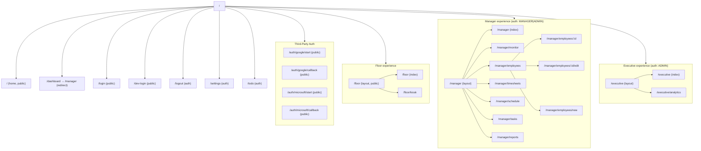

# Route Diagram

This document shows a high-level diagram of the main app routes and layouts.

## Notes

- All routes are children of the `root` layout defined in `src/routes/config.ts`.
- `manager` routes require `authMiddleware` and `roleMiddleware(["MANAGER", "ADMIN"])`.
- `executive` routes require `authMiddleware` and `roleMiddleware(["ADMIN"])`.
- `settings` and `todo` require `authMiddleware` only.

**Legend**

- `(public)` – no auth required
- `(auth)` – any authenticated user
- `(auth: ROLE)` – specific roles

> This diagram is a high-level view derived from `src/routes/config.ts`. For exact middleware
> and route options, see `src/routes/config.ts`.
